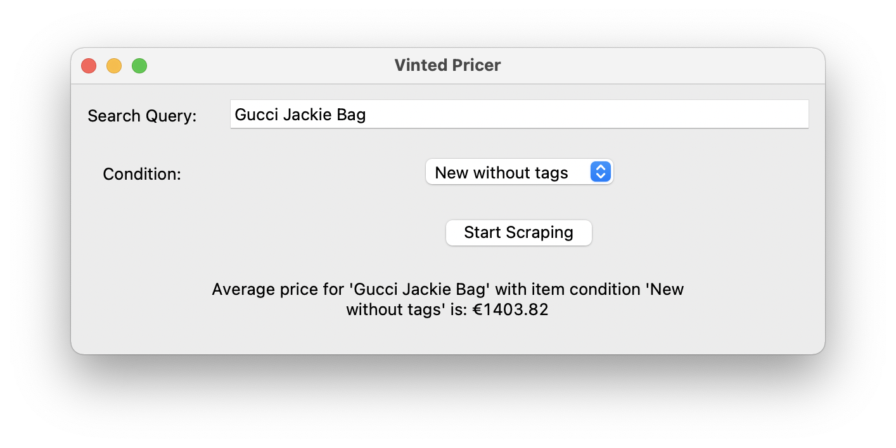

# Vinted Pricer

This tool allows you to scrape prices from Vinted (www.vinted.nl) based on a search query and item condition, and calculate the average price of the items found. The tool provides a simple GUI for entering the search query and starting the scraping process.



## Features

- Fetch prices from Vinted based on a search query and item condition.
- Calculate the average price of the items found.
- Simple GUI for ease of use.


## Installation

1. Clone the repository or download the scripts.
    ```bash
    git clone https://github.com/louiseleibbrandt/Vinted-pricer.git
    cd vinted-pricer
    ```

2. Install the required dependencies.
    ```bash
    pip install selenium webdriver-manager beautifulsoup4
    ```

3. This tool is currently only compatible with Chrome, please ensure Chrome is donwloaded and set as default browser.

## Usage

1. Run the `main.py` script to launch the GUI application.
    ```bash
    python scripts/main.py
    ```

2. Enter the search query and item condition in the provided input fields.

3. Click the "Start Scraping" button. If the number of items span multiple pages, each page containing items will be loaded and scraped sequentially.

4. The tool will display the average price of the items found based on your search query.


